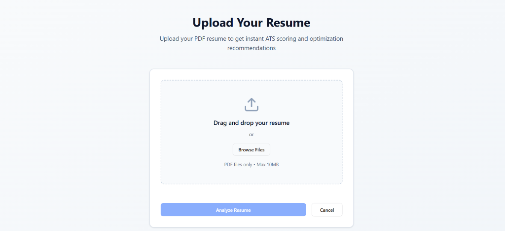
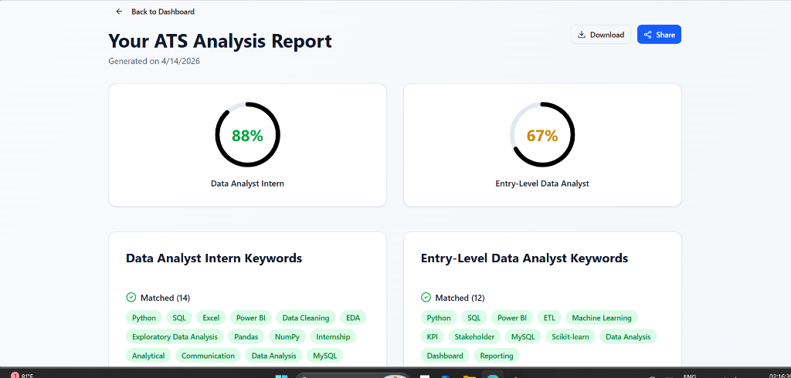

# ATS Resume Analyzer

<div align="center">
  
  
  
  
  
  
  
</div>
<br>

Production-ready full-stack application to analyze resumes for ATS compatibility, score them against Data Analyst role profiles, and generate rewrite suggestions.

## 🚀 One-Command Local Run

Make sure you have Node \>= 18 installed, and your `.env.local` is set up. Then simply run:

```bash
npx pnpm install && npx pnpm run dev
```

## 📸 Screenshots

| Dashboard & Upload | Analysis & Scoring |
| :---: | :---: |
|  |  |
| *Intuitive resume upload and ATS parsing* | *Comprehensive ATS scoring and keyword tracking* |

> **Note**: Add your UI screenshots as `upload.png` and `analysis.png` into a `docs/assets/` directory to display them here.

## Overview

ATS Resume Analyzer helps users:
- Upload PDF resumes
- Extract resume text
- Compute ATS scores for:
  - Data Analyst Intern
  - Entry-Level Data Analyst
- Identify matched and missing keywords
- Validate resume structure
- Save analysis history
- Generate rewrite suggestions (LLM + resilient fallback)

## Architecture At a Glance

```text
Client (React + TypeScript + tRPC)
  ->
Express Server (REST + tRPC)
  ->
Business Layer
  - ATS scoring engine
  - PDF extraction
  - Suggestion generator
  ->
MongoDB (users, resumes, analyses, rewriteSuggestions)
```

Detailed architecture docs:
- [docs/system-overview/ARCHITECTURE.md](docs/system-overview/ARCHITECTURE.md)
- [docs/system-overview/MONGODB_MIGRATION.md](docs/system-overview/MONGODB_MIGRATION.md)

## End-to-End Flow

1. User uploads PDF on Upload page.
2. `POST /api/upload` validates and extracts text from PDF.
3. Resume is persisted through `resume.upload` tRPC procedure.
4. `POST /api/analyze` computes ATS scoring and recommendations.
5. Analysis is persisted through `analysis.create`.
6. Results page loads data by `resumeId`.
7. Suggestion generation writes records to `rewriteSuggestions`.

## Tech Stack

### Frontend
- React 19
- TypeScript
- Vite
- Tailwind CSS + shadcn/ui
- Wouter
- TanStack Query + tRPC Client

### Backend
- Node.js + Express
- tRPC Server
- Zod
- Multer (file upload)
- pdf-parse (PDF text extraction)

### Data
- MongoDB (Atlas or local)
- Native MongoDB Node.js driver

### AI
- OpenAI-compatible chat completion path
- Resilient fallback suggestion generator for no-quota/network-failure scenarios

### Quality
- Vitest
- TypeScript strict mode

## Repository Structure

```text
.
├── client/                      # React application
├── server/                      # Express + tRPC + business logic
├── shared/                      # Shared types/constants
├── docs/
│   ├── startup/                 # Setup/run guides
│   ├── system-overview/         # Architecture and migration
│   ├── reference/               # API reference and docs index
│   └── changelog/               # Consolidated change history
├── drizzle/                     # Legacy schema artifacts (not runtime DB path)
├── package.json
└── README.md
```

## Prerequisites

- Node.js 18+
- pnpm 10+
- MongoDB Atlas account or local MongoDB
- OpenAI API key (optional but recommended)

## Quick Start

### 1) Install dependencies

```bash
pnpm install
```

If `pnpm` is not on PATH in your shell, use:

```bash
npx pnpm install
```

### 2) Create environment file

Create `.env.local` in project root:

```env
MONGODB_URI=mongodb+srv://<user>:<password>@<cluster>/<db>?retryWrites=true&w=majority
OPENAI_API_KEY=sk-...
JWT_SECRET=replace-with-min-32-char-secret
NODE_ENV=development
VITE_APP_TITLE=ATS Resume Analyzer

# Local/dev auth and oauth-related settings
VITE_OAUTH_PORTAL_URL=http://localhost:3001
VITE_APP_ID=local-dev-app
OAUTH_SERVER_URL=http://localhost:3001
DEV_BYPASS_AUTH=true

# Optional
OPENAI_MODEL=gpt-4o-mini
VITE_ANALYTICS_ENDPOINT=http://localhost:8080/api/send
VITE_ANALYTICS_WEBSITE_ID=local-dev
BUILT_IN_FORGE_API_URL=
BUILT_IN_FORGE_API_KEY=
```

### 3) Start development server

```bash
pnpm dev
```

or

```bash
npx pnpm dev
```

### 4) Open app

Navigate to URL shown in terminal (usually `http://localhost:3000`, next free port otherwise).

## NPM Scripts

```bash
pnpm dev      # run development server
pnpm build    # production build
pnpm start    # run production server
pnpm check    # type-check
pnpm test     # run tests
pnpm format   # format codebase
```

## Environment Variables

| Variable | Required | Purpose |
|---|---|---|
| `MONGODB_URI` | Yes | MongoDB connection string |
| `JWT_SECRET` | Yes | Session/JWT signing secret |
| `NODE_ENV` | Yes | Runtime mode (`development`/`production`) |
| `OPENAI_API_KEY` | Recommended | LLM suggestions and summary |
| `OPENAI_MODEL` | Optional | Model override (default `gpt-4o-mini`) |
| `VITE_APP_TITLE` | Optional | Frontend title |
| `VITE_OAUTH_PORTAL_URL` | Dev | Frontend login URL base |
| `VITE_APP_ID` | Dev | Frontend app identifier |
| `OAUTH_SERVER_URL` | Dev/Prod | OAuth service base URL |
| `DEV_BYPASS_AUTH` | Dev | Enables local auth bypass when true |
| `VITE_ANALYTICS_ENDPOINT` | Optional | Analytics endpoint |
| `VITE_ANALYTICS_WEBSITE_ID` | Optional | Analytics site id |
| `BUILT_IN_FORGE_API_URL` | Optional | Forge endpoint override |
| `BUILT_IN_FORGE_API_KEY` | Optional | Forge key override |

## API Summary

### REST
- `POST /api/upload` - Upload PDF + extract text
- `POST /api/analyze` - Run ATS analysis for raw text

### tRPC
- `auth.me`
- `auth.logout`
- `resume.upload`
- `resume.getHistory`
- `resume.getById`
- `analysis.create`
- `analysis.getByResumeId`
- `suggestions.generate`
- `suggestions.summary`
- `suggestions.byAnalysisId`

Full API documentation:
- [docs/reference/API_REFERENCE.md](docs/reference/API_REFERENCE.md)

## Data Model (MongoDB Collections)

- `users`
- `resumes`
- `analyses`
- `rewriteSuggestions`

Behavior highlights:
- Resume and analysis are always persisted.
- Suggestion rows are persisted per `analysisId`.
- If LLM call fails, fallback generator still returns and persists suggestions.

## Auth Behavior

- Production-style auth path uses OAuth/session cookie validation.
- Local development can use `DEV_BYPASS_AUTH=true` to keep workflow unblocked.

## Troubleshooting

### Suggestion API returns quota errors
- If OpenAI quota is exceeded, fallback mode is used automatically.
- Suggestions should still render and be saved in DB.

### Upload fails
- Ensure uploaded file is a valid PDF and size <= 10MB.
- Check server logs for parser errors.

### MongoDB connection issues
- Verify Atlas IP allowlist.
- Verify username/password in `MONGODB_URI`.
- Prefer full non-SRV URI if your network has SRV DNS restrictions.

### pnpm or node not found
- Restart terminal after install.
- Use `npx pnpm <command>` as fallback.

## Documentation Map

- Startup:
  - [docs/startup/QUICKSTART.md](docs/startup/QUICKSTART.md)
  - [docs/startup/SETUP_GUIDE.md](docs/startup/SETUP_GUIDE.md)
  - [docs/startup/MONGODB_ATLAS_SETUP.md](docs/startup/MONGODB_ATLAS_SETUP.md)
- System overview:
  - [docs/system-overview/ARCHITECTURE.md](docs/system-overview/ARCHITECTURE.md)
  - [docs/system-overview/MONGODB_MIGRATION.md](docs/system-overview/MONGODB_MIGRATION.md)
- Reference:
  - [docs/reference/API_REFERENCE.md](docs/reference/API_REFERENCE.md)
  - [docs/reference/DOCUMENTATION_INDEX.md](docs/reference/DOCUMENTATION_INDEX.md)
- Changes:
  - [docs/changelog/CHANGELOG_2026-04-14_MASTER.md](docs/changelog/CHANGELOG_2026-04-14_MASTER.md)

## Security Notes

- Never commit `.env.local`.
- Rotate OpenAI and Mongo credentials if exposed.
- Use strong JWT secret in all environments.

## License

MIT
